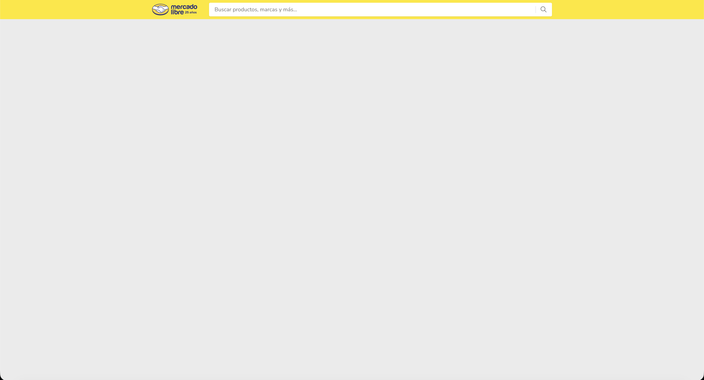
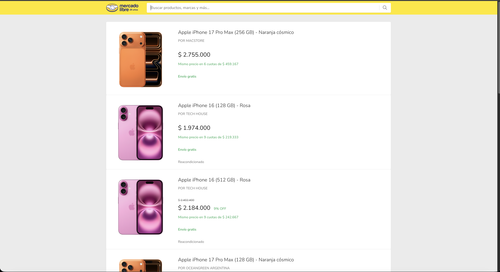
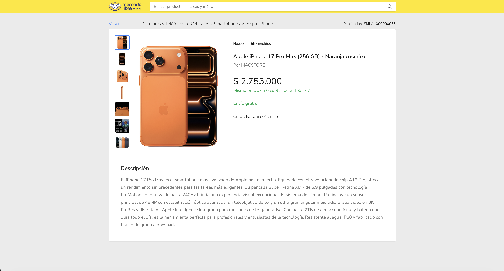
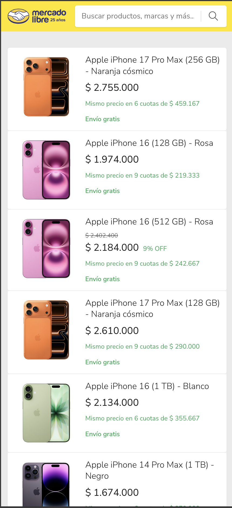
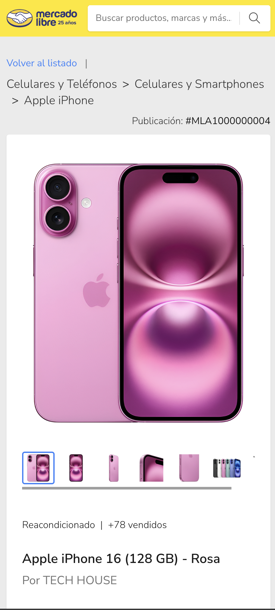
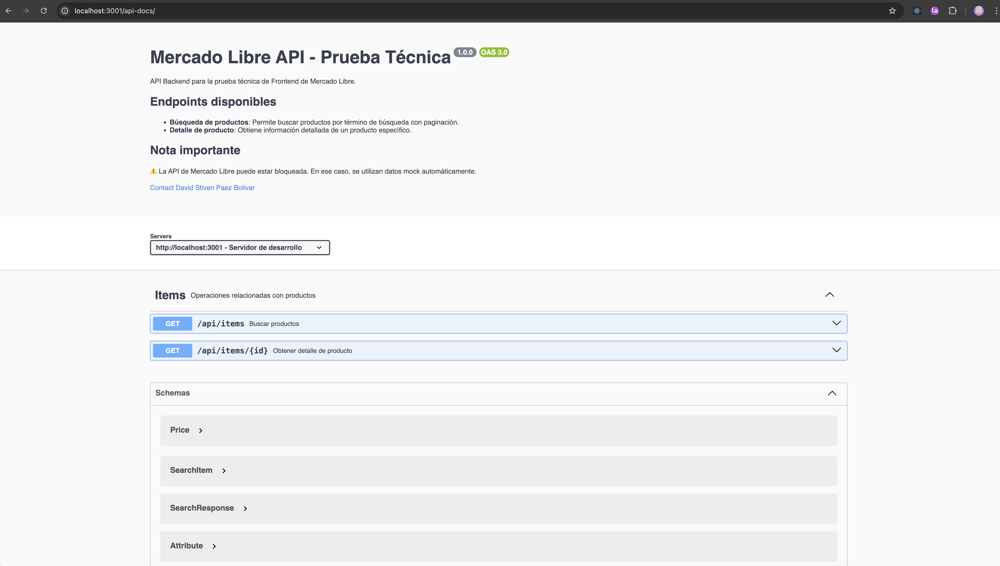

# 🛒 Prueba Técnica Frontend - Mercado Libre

<p align="center">
  
</p>

<p align="center">
  Aplicación de búsqueda y visualización de productos desarrollada como prueba técnica para el área de Frontend de Mercado Libre.
</p>

---

## 📋 Descripción

Aplicación web que permite buscar productos, ver resultados paginados y acceder al detalle de cada producto. Implementa el flujo completo de navegación de un e-commerce.

| Vista | URL | Descripción |
|-------|-----|-------------|
| 🏠 Inicio | `/` | Caja de búsqueda |
| 🔍 Resultados | `/items?search=` | Lista paginada de productos |
| 📦 Detalle | `/items/:id` | Información completa del producto |

---

## 🛠️ Stack Tecnológico

| Frontend | Backend |
|----------|---------|
| React 19 | Node.js 20+ |
| TypeScript 5.7 | Express 4.21 |
| Vite 6.0 | TypeScript 5.7 |
| Zustand 5 | Swagger/OpenAPI |
| SCSS (BEM) | Vitest |
| React Router 7 | |

---

## 📦 Instalación Rápida

**Prerrequisitos:** Node.js >= 20, npm >= 10

```bash
# 1. Clonar repositorio
git clone https://github.com/DavidPaez592/pruebaTecnicaMeli.git
cd pruebaTecnicaMeli

# 2. Backend (Terminal 1)
cd backend && npm install && npm run dev

# 3. Frontend (Terminal 2)
cd frontend && npm install && npm run dev
```

| Servicio | URL |
|----------|-----|
| 🌐 **Frontend** | http://localhost:3000 |
| 🔌 **Backend API** | http://localhost:3001/api |
| 📚 **Swagger Docs** | http://localhost:3001/api-docs |

> 📖 Ver documentación detallada: [Backend README](./backend/README.md) | [Frontend README](./frontend/README.md)

---

## 🧪 Tests

```bash
# Frontend (121 tests)
cd frontend && npm test

# Backend (35 tests)
cd backend && npm test
```

| Módulo | Tests | Cobertura |
|--------|-------|-----------|
| Frontend | 121 | Componentes, stores, hooks, utils |
| Backend | 35 | Mock data, filtrado, especificaciones |

---

## ✅ Requisitos Cumplidos

### Obligatorios ✅
- [x] HTML semántico
- [x] React + TypeScript
- [x] SCSS con metodología BEM
- [x] Node.js >= 20 + Express
- [x] Tres vistas navegables
- [x] Dos endpoints API
- [x] Diseño responsive
- [x] Repositorio en GitHub

### Opcionales (Implementados) ✅
- [x] Paginación de 10 en 10
- [x] Cache de 50 items (evita API calls)
- [x] Control de offset
- [x] Mensaje de bienvenida (solo primera visita)

### Extras Adicionales 🌟
- [x] SEO dinámico (meta tags, Open Graph)
- [x] Sistema de notificaciones (toasts)
- [x] Galería de imágenes interactiva
- [x] Swagger UI para API
- [x] 156 tests unitarios
- [x] Health check endpoint

---

## ⚠️ Nota sobre la API de Mercado Libre

La API pública de ML bloquea peticiones con error `403 Forbidden`. Se implementó un **fallback con datos mock** que permite demostrar toda la funcionalidad.

> 📄 Ver informe completo: [INFORME-API-MERCADOLIBRE.md](./Desafio/INFORME-API-MERCADOLIBRE.md)  
> 📖 Solución técnica: [Backend README - Sección API](./backend/README.md#️-problema-con-la-api-de-mercado-libre)

---

## 📁 Estructura del Proyecto

```
pruebaTecnicaMeli/
├── backend/          # Servidor Express + API
│   └── README.md     # Documentación completa del backend
├── frontend/         # Cliente React + Vite
│   └── README.md     # Documentación completa del frontend
├── Desafio/          # Archivos de la prueba técnica
│   └── INFORME-API-MERCADOLIBRE.md
├── screenshots/      # Capturas de pantalla
└── README.md         # Este archivo
```

---

## 👨‍💻 Autor

**David Stiven Paez Bolivar**  
📧 davidpaez502@gmail.com  
🐙 [@DavidPaez592](https://github.com/DavidPaez592)

📅 Diciembre 2025

---

## 📸 Screenshots

### Página de Inicio


---

### Resultados de Búsqueda


---

### Detalle de Producto


---

### Vista Mobile
| Resultados | Detalle |
|------------|---------|
|  |  |

---

### Swagger Documentation


---